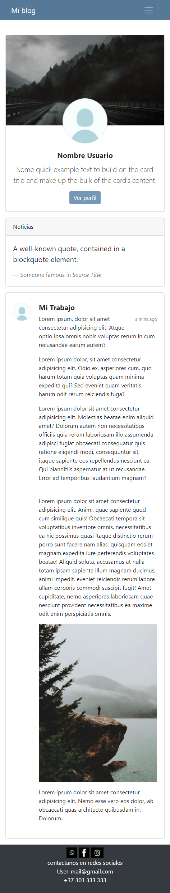

# Blog-tipo-Portafolio
Este proyecto desarrolla un blog personal tipo portafolio. Consta de una navegación tipo responsiva, utiliza la implementación de la biblioteca multiplataforma Bootstrap, consta de un menú interactivo el cual está conectado a diferentes artículos que forman parte del portafolio, en él se maneja la aplicación de diferentes componentes de esta biblioteca tales como: Cards, collapse, formulario entre otras. Se caracteriza por estar conectado a redes Sociales como Instagram.

---

## Modelo Responsivo

## Movil y Tablet

La web responsiva se adapta a la resolución móvil reorganizando el contenido por medio de la grid responsive manejada en bootstrap, escalando imagenes, y simplificando el menú. Los contenidos de la página web son adaptados a todos los tamaños de tal forma que puede verse en todas las pantallas.

| Movil| Ordenador|
|-------|--------|
|  |  |
|  |  |
 
## Ordenador

En la resolución tipo ordenador se redimensionan los elementos de la web para que se adapte al ancho del dispositivo y así brindarle una mejor visualización al usuario, de igual forma en ella se puede visualizar la adaptación de imágenes, iconos, menús entre otros tamaños de los elementos utilizados. Con el fin de brindarle una mejor experiencia al usuario. 

| Movil |Ordenador |
|-------|--------|
|  |  |

---

## Caracteristicas

* Tiene un menú interactivo
* Es un blog de varias páginas conectadas
* Esta vinculación con una red social
* Tiene Botones interactivos

---
## Lenguajes Usados

|logo | lenguaje|
|-------|--------|
|   | BOOTSTRAP |
|   | CSS |
|   | Java |